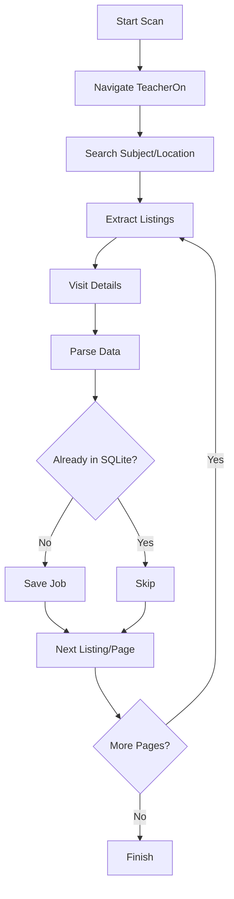
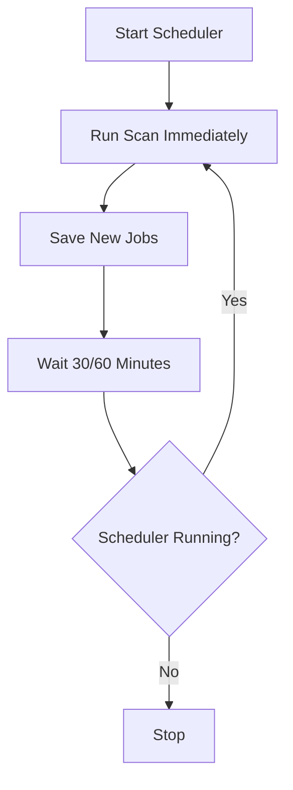

# TeacherOn Tutor Job Scraper — Implementation Plan

> **Document Version:** 1.0  
> **Date:** April 2026  
> **Purpose:** A beginner-friendly, phase-by-phase blueprint for building an Electron desktop application that scrapes public tutor job listings from [TeacherOn.com](https://www.teacheron.com).

---

## Table of Contents

1. [Project Goals & Non-Goals](#1-project-goals--non-goals)
2. [Tech Stack & Responsibilities](#2-tech-stack--responsibilities)
3. [Folder Structure](#3-folder-structure)
4. [Overall Architecture](#4-overall-architecture)
5. [Electron IPC Architecture](#5-electron-ipc-architecture)
6. [Scraping Workflow](#6-scraping-workflow)
7. [Scheduler Workflow](#7-scheduler-workflow)
8. [SQLite Schema](#8-sqlite-schema)
9. [Camoufox + Playwright Feasibility & Risks](#9-camoufox--playwright-feasibility--risks)
10. [Security Considerations](#10-security-considerations)
11. [Error Handling](#11-error-handling)
12. [Step-by-Step Implementation Phases](#12-step-by-step-implementation-phases)
13. [Learning Objective for Each Phase](#13-learning-objective-for-each-phase)
14. [Testing & Acceptance Criteria](#14-testing--acceptance-criteria)
15. [Final Implementation Checklist](#15-final-implementation-checklist)

---

## 1. Project Goals & Non-Goals

### Goals

| # | Goal | Why It Matters |
|---|------|----------------|
| G1 | Accept a **Subject** and **Location** from the user via UI | The core input for filtering relevant tutor jobs |
| G2 | Scrape the first **2–3 pages** of teacheron.com/tutor-jobs | Limits load on the target site; 2–3 pages is enough for practical use |
| G3 | Extract 8 fields per job: `title`, `subject`, `location`, `student_level`, `budget`, `description`, `posted_date`, `job_url` | Provides a complete snapshot of each listing |
| G4 | Add a `scraped_at` timestamp per job | Enables tracking of when each record was captured |
| G5 | Store jobs in a local **SQLite** database with uniqueness enforced on `job_url` | Prevents duplicate entries across scans |
| G6 | Display scraped results in an **Electron UI** table | Makes the data browsable and searchable |
| G7 | Allow opening the original TeacherOn job URL in the default browser | Quick access to full listing detail |
| G8 | Run **scheduled scans** every 30 or 60 minutes (user-selectable) | Automates data collection; surfaces fresh jobs |
| G9 | Save only **new** jobs (duplicate detection via `job_url`) | Keeps the database clean and avoids noise |
| G10 | Gracefully handle pagination, missing fields, network timeouts, partial failures | Robustness for real-world scraping |
| G11 | Perform a **graceful shutdown** when the app closes | Prevents resource leaks |
| G12 | Keep Playwright, Camoufox, and SQLite in the **main process only** | Security best-practice |
| G13 | Expose functionality through a **secure preload** and **IPC bridge** | Follows Electron security guidelines |

### Non-Goals

---

## 2. Tech Stack & Responsibilities

| Technology | Version (approx.) | Role | Runs In |
|------------|-------------------|------|---------|
| **Node.js** | ≥ 20 LTS | JavaScript runtime | Main + Renderer |
| **Electron** | ≥ 33 | Desktop app shell, window management | Both |
| **Playwright** | ≥ 1.50 | Browser automation (Firefox channel) | Main process only |
| **Camoufox** | ≥ 146.x (Firefox fork) | Anti-detect browser binary; launched via `executablePath` | Main process only |
| **SQLite** via `better-sqlite3` | ≥ 11.x | Synchronous local database | Main process only |
| **node-cron** | Latest | In-process job scheduler | Main process only |
| **Preload** (Electron) | N/A | Secure bridge via `contextBridge` | Preload context |
| **HTML/CSS/JS** (vanilla) | N/A | Renderer UI: form, table, buttons | Renderer process |

### Why `better-sqlite3`?

- Synchronous API — simpler for a single-user desktop app.
- No separate server process needed.
- Fast, well-maintained, and commonly used with Electron.
- Synchronous calls in the main process do not block the renderer.

### Why `node-cron`?

- Lightweight, zero-dependency cron-syntax scheduler.
- Runs inside the Electron main process.
- Ideal for "every 30 minutes" / "every 60 minutes" patterns.

---

## 3. Folder Structure

```
TeacherOnJobScraper/
├── package.json
├── README.md
├── .gitignore
├── docs/
│   └── teacheron-scraper-implementation-plan.md   # ← this file
├── src/
│   ├── main/                    # Electron main process
│   │   ├── main.js              # Entry point: create window, register IPC, init
│   │   ├── preload.js           # Secure preload script (contextBridge)
│   │   ├── ipc-handlers.js      # All IPC handler registrations
│   │   ├── scraper.js           # Scraping logic (Playwright + Camoufox)
│   │   ├── database.js          # SQLite setup, queries, upsert logic
│   │   ├── scheduler.js         # node-cron scheduler setup/teardown
│   │   └── config.js            # Constants (URLs, selectors, intervals)
│   ├── renderer/                # Renderer process (UI)
│   │   ├── index.html           # Main window HTML
│   │   ├── renderer.js          # Frontend JS (calls API methods from preload)
│   │   └── styles.css           # Styling
│   └── shared/                  # (optional) Shared constants/types
│       └── constants.js         # IPC channel names, job field names
└── data/                        # (gitignored) Runtime data
    └── teacheron.db             # SQLite database file
```

### `.gitignore` Highlights

```
node_modules/
dist/
data/
*.db
.env
```

---

## 4. Overall Architecture

```mermaid
flowchart TD
    UI[Electron Renderer] --> PRELOAD[Preload]
    PRELOAD --> IPC[IPC]
    IPC --> MAIN[Electron Main]
    MAIN --> SCHED[Scheduler]
    SCHED --> SCRAPER[Scraper]
---

## 5. Electron IPC Architecture

```mermaid
sequenceDiagram
    participant R as Renderer
    participant P as Preload
    participant M as Main
    participant S as Scraper
    participant D as SQLite

    R->>P: Start Scan
    P->>M: IPC Request
    M->>S: Start Scraping
    S->>D: Save New Jobs
    S-->>M: Progress/Results
    M-->>P: IPC Response
    P-->>R: Update UI
```

### IPC Channel Definitions

| Channel | Direction | Pattern | Purpose |
|---------|-----------|---------|---------|
| `scan:start` | Renderer → Main | `invoke`/`handle` | User clicks "Start Scan" — main returns `{ jobCount, errors[] }` |
| `scan:stop` | Renderer → Main | `invoke`/`handle` | User clicks "Stop Scan" — main gracefully stops the ongoing scan |
| `scan:progress` | Main → Renderer | `send`/`on` | Push progress updates: `{ page, found, saved, phase }` |
| `scan:error` | Main → Renderer | `send`/`on` | Push error events: `{ message, timestamp }` |
| `jobs:get-all` | Renderer → Main | `invoke`/`handle` | Fetch all stored jobs from SQLite |
| `jobs:get-recent` | Renderer → Main | `invoke`/`handle` | Fetch jobs from last N hours/days |
| `jobs:open-url` | Renderer → Main | `invoke`/`handle` | Open a job URL in the default browser via `shell.openExternal()` |
| `scheduler:start` | Renderer → Main | `invoke`/`handle` | Start the cron scheduler at given interval |
| `scheduler:stop` | Renderer → Main | `invoke`/`handle` | Stop the cron scheduler |
| `scheduler:status` | Renderer → Main | `invoke`/`handle` | Get current scheduler status |
| `app:quit` | Renderer → Main | `invoke`/`handle` | Graceful shutdown |

### Preload API Shape

```js
// Exposed via contextBridge as window.scraperAPI
{
  // Scan
  startScan: (subject, location) => ipcRenderer.invoke('scan:start', { subject, location }),
  stopScan: () => ipcRenderer.invoke('scan:stop'),

  // Jobs
  getJobs: () => ipcRenderer.invoke('jobs:get-all'),
  getRecentJobs: (hours) => ipcRenderer.invoke('jobs:get-recent', hours),
  openJobUrl: (url) => ipcRenderer.invoke('jobs:open-url', url),

  // Scheduler
  startScheduler: (intervalMinutes) => ipcRenderer.invoke('scheduler:start', intervalMinutes),
  stopScheduler: () => ipcRenderer.invoke('scheduler:stop'),
  getSchedulerStatus: () => ipcRenderer.invoke('scheduler:status'),

  // Events (Renderer listens)
  onScanProgress: (callback) => { ipcRenderer.on('scan:progress', (_e, d) => callback(d)); },
  onScanError: (callback) => { ipcRenderer.on('scan:error', (_e, d) => callback(d)); },
  removeScanProgressListener: () => { ipcRenderer.removeAllListeners('scan:progress'); },
  removeScanErrorListener: () => { ipcRenderer.removeAllListeners('scan:error'); },
}
```

---

## 6. Scraping Workflow



### Detailed Scraping Steps

#### Step 1: Navigate to TeacherOn Tutor Jobs
---

## 7. Scheduler Workflow



### Scheduler Details

- Use **`node-cron`** for the scheduling engine.
- User starts scheduler from the UI via "Start Scheduled Scanning".
- Stops on: user clicks "Stop", or app is closing.
- First scan runs **immediately**, then every N minutes.

#### node-cron Expressions
- Every 30 minutes: `*/30 * * * *`
- Every 60 minutes: `0 * * * *`

#### State Management

```js
// scheduler.js state
let cronJob = null;
let interval = 30; // minutes
let lastRun = null;
let isRunning = false;
```

#### Concurrency Guard
- Check if a scan is already in progress before starting a new one.
- If yes → skip this scheduled tick (log a warning).

---

## 8. SQLite Schema

Database file: `data/teacheron.db` — created automatically on first run.

```sql
CREATE TABLE IF NOT EXISTS jobs (
    id            INTEGER PRIMARY KEY AUTOINCREMENT,
    title         TEXT    NOT NULL,
    subject       TEXT,
    location      TEXT,
    student_level TEXT,
    budget        TEXT,
    description   TEXT,
    posted_date   TEXT,
    job_url       TEXT    NOT NULL UNIQUE,
    scraped_at    TEXT    NOT NULL DEFAULT (datetime('now'))
);

CREATE UNIQUE INDEX IF NOT EXISTS idx_jobs_url ON jobs(job_url);
CREATE INDEX IF NOT EXISTS idx_jobs_scraped_at ON jobs(scraped_at);
```

### Field Descriptions

| Column | Type | Required | Source | Notes |
|--------|------|----------|--------|-------|
| `id` | INTEGER | Auto | SQLite | Auto-increment primary key |
| `title` | TEXT | Yes | Listing card heading | Full title as shown |
| `subject` | TEXT | No | Search context / listing | Inferred from search or listing |
| `location` | TEXT | No | Listing card | City, state, country |
| `student_level` | TEXT | No | Detail page or listing | e.g., "Grade 5", "Bachelors" |
| `budget` | TEXT | No | Listing card | e.g., "$58 (Fixed)", "$9/hour" |
| `description` | TEXT | No | Listing card or detail | Short blurb |
| `posted_date` | TEXT | No | Listing card | Relative time ("6 mins ago") |
| `job_url` | TEXT | Yes (unique) | Listing card link | Full URL |
| `scraped_at` | TEXT | Yes (auto) | System clock | ISO 8601 at insert time |

### CRUD Operations (`database.js`)

```js
db.initialize()           // Create tables and indexes
db.insertJob(jobData)     // INSERT, skip if job_url exists → { inserted, id }
db.getAllJobs()           // SELECT all, ordered by scraped_at DESC
db.getRecentJobs(hours)   // SELECT jobs from last N hours
db.jobExists(job_url)     // Boolean check
db.getJobCount()          // Number
db.clearJobs()            // DELETE all (for testing)
db.close()                // Close connection
```
---

## 9. Camoufox + Playwright Feasibility & Risks

### What Is Camoufox?

Camoufox is an **open-source anti-detect browser** built on **Firefox**. It patches Firefox at the C++ level to spoof/modify fingerprint data (navigator, WebGL, fonts, screen, WebRTC, geolocation) without JavaScript injection — making automation harder to detect. Website: [camoufox.com](https://camoufox.com) | GitHub: [daijro/camoufox](https://github.com/daijro/camoufox)

### Can Camoufox Work with Node.js Playwright?

**Yes, with constraints:**

| Approach | Feasibility | How |
|----------|-------------|-----|
| **Launch binary via `firefox` channel** | ✅ **Recommended** | Download Camoufox binary, point `firefox.launch({ executablePath: '...' })` to it. Uses same Juggler protocol as Firefox. |
| **Use Camoufox's Python wrapper** | ❌ Not feasible | Wraps Playwright-Python. Does not work in Node.js. |
| **Run Python subprocess from Electron** | ⚠️ Messy | Adds Python dependency and IPC overhead. Not recommended. |

### Recommended: Direct Binary Launch

```js
const { firefox } = require('playwright');
const browser = await firefox.launch({
  executablePath: '/Applications/Camoufox.app/Contents/MacOS/camoufox',
  headless: true,
});
```

- Download macOS binary from [GitHub Releases](https://github.com/daijro/camoufox/releases).
- Playwright's `firefox` channel works out of the box — same Juggler protocol.
- Fingerprint injection is at engine level — no Python needed.
- **Note:** Auto-rotating fingerprints (BrowserForge) are Python-only. Not needed at 30–60 min intervals.

### Risk Assessment

| Risk | Severity | Mitigation |
|------|----------|------------|
| Binary availability for macOS | Low | Pre-built binaries via GitHub Releases / Homebrew |
| Binary out-of-date | Medium | Pin a specific version; document upgrade steps |
| No auto-fingerprint rotation in Node.js | Low | Not needed for single-user at 30–60 min intervals |
| TeacherOn blocks Camoufox | Medium | Fall back to Playwright + regular Firefox + manual stealth |
| Under active development (beta) | Medium | Pin stable release; test before upgrading |
| macOS Gatekeeper issues | Low | Right-click → Open to bypass; document |

### Fallback Strategy (If Camoufox Fails)

1. Use Playwright with regular Firefox (`firefox.launch()` without custom `executablePath`).
2. Manual stealth: realistic viewport (1280×720), common User-Agent, realistic headers, random delays (1–3s).
3. Zero additional dependencies — just Playwright.

> **Recommendation:** Start with Camoufox. Keep regular Firefox fallback behind a config flag.

---

## 10. Security Considerations

| # | Consideration | Implementation |
|---|---------------|----------------|
| S1 | `contextIsolation: true` | Always set in `webPreferences` |
| S2 | `nodeIntegration: false` | Disabled in renderer |
| S3 | `sandbox: true` | Enabled on renderer |
| S4 | Preload exposes only needed methods | `contextBridge.exposeInMainWorld()` with curated methods; never expose `ipcRenderer` |
| S5 | Validate IPC inputs | Validate shape/types in every handler |
| S6 | No `eval()`/`innerHTML` from scraped data | Use `textContent` or escaping |
| S7 | DB in app data directory | `app.getPath('userData')` or project `data/` |
| S8 | `shell.openExternal` validation | Validate URL starts with `https://www.teacheron.com/` |
| S9 | No secrets in code | Use env vars / `.env` for proxies |
| S10 | CSP meta tag | Set in renderer HTML |

---

## 11. Error Handling

### Error Categories & Strategies

| Category | Strategy |
|----------|----------|
| **Network Errors** | Retry 2× with exponential backoff (1s, 2s). Skip on final failure. Report to UI. |
---

## 12. Step-by-Step Implementation Phases

Each phase is designed for **one sitting (1–3 hours)**. **Learn the technology first, then implement.**

### Phase 0: Project Setup & Tooling (~30 min)

**Tasks:**
1. Initialize project with `npm init`.
2. Install Electron as dev dependency.
3. Create folder structure (`src/main/`, `src/renderer/`, `docs/`).
4. Create `src/main/main.js` with minimal Electron app (create window, load `index.html`).
5. Create `src/renderer/index.html` with "Hello, TeacherOn Scraper!".
6. Create `src/main/preload.js` with basic `contextBridge` setup.
7. Add `start` and `dev` scripts to `package.json`.
8. Verify the Electron window opens.

**Acceptance:** `npm start` opens an Electron window. DevTools open in dev mode.

---

### Phase 1: Electron IPC Foundation (~1 hr)

**Tasks:**
1. Define IPC channel constants in `src/shared/constants.js`.
2. Build full preload API (`preload.js`) exposing `window.scraperAPI` with all methods.
3. Create `src/main/ipc-handlers.js` with stub handlers returning mock data.
4. Register all handlers in `main.js`.
5. Create `src/renderer/renderer.js` and test IPC round-trip from DevTools.

**Acceptance:** `window.scraperAPI.getJobs()` returns mock data. All IPC channels registered. `require()` not available in renderer.

---

### Phase 2: SQLite Database Layer (~1 hr)

**Tasks:**
1. Install `better-sqlite3` (`npm install better-sqlite3`).
2. Rebuild for Electron (`@electron/rebuild`).
3. Create `database.js` with: `initialize()`, `insertJob()`, `getAllJobs()`, `jobExists()`, `close()`.
4. Wire `initialize()` into `app.whenReady()`, `close()` into `app.on('will-quit')`.
---

### Phase 4: Scraping Engine — Listing Page (~2 hr)

**Tasks:**
1. Study TeacherOn tutor-jobs page DOM structure (use DevTools on a manual visit).
2. Identify CSS selectors for: card container, title, location, budget, description, posted time, job link (`href`).
3. Implement `scrapeListingPage(page, subject, location)`:
   - Navigate to `https://www.teacheron.com/tutor-jobs`.
   - Interact with search form (fill subject, fill location, click Search).
   - Wait for results to load.
   - Extract all job cards into `[{ title, location, budget, description, posted_date, job_url }]`.
   - Handle missing fields → set to `null`.
4. Implement `scrapeJobDetailPage(page, job_url)` (optional):
   - Navigate to detail page. Extract `student_level` and fuller `description`.
   - Handle 404/redirect gracefully.
5. Wire into `scan:start` IPC handler:
   - Accept `subject`, `location`. Call `scrapeListingPage()`.
   - For each job, check `database.jobExists()`, insert if new.
   - Send progress via `webContents.send('scan:progress', ...)`.
   - Return `{ jobCount, newJobs, errors }`.
6. Add `isScanning` flag to prevent concurrent scans.

**Acceptance:** Real scrape works. New jobs inserted. Duplicates skipped. Progress sent to UI. Errors logged, scan continues.

---

### Phase 5: Pagination Handling (~1 hr)

**Tasks:**
1. Add `scrapePage(page, pageNumber)` for single-page extraction.
2. Add `goToNextPage(page)` — finds and clicks "Next" link.
3. Add `hasNextPage(page)` — checks for next page existence.
4. Build loop: `for pageNum=1 to MAX_PAGES: scrapePage(); if pageNum<MAX_PAGES && hasNextPage() → goToNextPage() + wait 1.5s; else break`.
5. Handle single-page-of-results case.

**Acceptance:** Scraping moves through 2–3 pages correctly. Stops when no more pages. Delay between pages respected.

---

### Phase 6: Basic Renderer UI (~2 hr)

**Tasks:**
1. Build `index.html`: search form (Subject + Location + Start/Stop), results table (Title, Subject, Location, Budget, Posted, scraped_at, Open button), scheduler panel (interval selector + Start/Stop + status), status bar (progress), error log (collapsible).
2. Style with `styles.css`: clean table, resizable, visual state indicators.
3. Build `renderer.js`: wire form to API calls, listen for progress/error events, populate table from `getJobs()`, wire Open buttons to `openJobUrl()`, wire scheduler buttons, disable Start during scan.

**Acceptance:** User enters Subject+Location, clicks Scan. Progress real-time. Jobs in table. Open button opens browser. Start disabled during scan. Errors in log.

---

### Phase 7: Scheduler Implementation (~1 hr)

**Tasks:**
1. Install `node-cron`.
2. Create `scheduler.js`: `start(intervalMinutes, scanCallback)`, `stop()`, `getStatus()`.
3. Guard overlapping scans with `isScanning` flag — skip tick if true.
4. Wire `scheduler:start`/`scheduler:stop`/`scheduler:status` IPC handlers.
5. `app.on('before-quit')` calls `scheduler.stop()`.

**Acceptance:** Starting scheduler triggers immediate scan. Subsequent scans at chosen interval. Overlapping skipped. Stopping prevents further scans. Clean shutdown.

---

### Phase 8: Graceful Shutdown & Robustness (~45 min)

**Tasks:**
1. Implement `app.on('before-quit')`: close browser → stop scheduler → close DB → `app.exit(0)`.
2. Handle SIGINT/SIGTERM.
3. `window.onbeforeunload` confirmation if scan active.
4. Force-close timeout if graceful close takes > 5s.
5. Add Quit button in UI.

**Acceptance:** Confirmation dialog during active scan. No zombie processes after exit (verify with `ps aux`).

---

### Phase 9: Error Logging & UI Polish (~1 hr)

**Tasks:**
1. Add `logger.js` utility (writes to `logs/` file, sends to renderer).
2. Add retry logic: `async withRetry(fn, maxRetries=2)` with exponential backoff.
3. Improve error messages (include page/job URL/selector context).
4. Add "Clear Error Log" and "Clear All Jobs" (with confirmation) buttons.
5. Keyboard shortcuts: `Cmd+Shift+S` for Scan, `Cmd+Shift+X` for Stop.
6. Set minimum window size (800×600).

**Acceptance:** Descriptive errors with context. Retry handles transient failures. Polished, usable UI.

---

### Phase 10: Testing & Bug Fixing (~2 hr)

---

## 13. Learning Objective for Each Phase

| Phase | What You'll Learn |
|-------|-------------------|
| **Phase 0** | npm project initialization, Electron app basics, `BrowserWindow`, file organization |
| **Phase 1** | Electron security model, `contextBridge`, `ipcRenderer`/`ipcMain` patterns, why main/renderer separation matters |
| **Phase 2** | SQLite with Node.js, `better-sqlite3`, synchronous DB operations, schema design, `UNIQUE` constraints, `@electron/rebuild` for native modules |
| **Phase 3** | Playwright installation and launch, browser channel selection, `executablePath` for custom browsers, Camoufox as a Firefox fork, headless vs headful |
| **Phase 4** | Playwright selectors, `page.$$eval`, text extraction, waiting for elements, handling dynamic content, search form interaction, parsing unstructured HTML |
| **Phase 5** | Pagination logic, loop control, detecting "next" links, graceful exit when pages run out, polite delays |
| **Phase 6** | Electron renderer UI, DOM manipulation, event handling, IPC listener patterns, dynamic table rendering, `shell.openExternal` |
| **Phase 7** | `node-cron` scheduling, cron expressions, concurrency guards, interval-based automation |
| **Phase 8** | Electron lifecycle events (`before-quit`, `will-quit`), graceful shutdown patterns, resource cleanup, zombie process prevention |
| **Phase 9** | Logging patterns, retry logic with exponential backoff, UI polish, keyboard shortcuts in Electron |
| **Phase 10** | Manual testing methodology, edge case discovery, debugging async code, network throttling for testing |

---

## 14. Testing & Acceptance Criteria

### Functional Tests

| Test ID | Scenario | Expected Result |
|---------|----------|-----------------|
| T1 | Launch app | Electron window opens, no console errors |
| T2 | Enter "Maths" + "San Diego" → Start Scan | Jobs appear in table within 10–30 seconds |
| T3 | Leave Subject and Location empty → Start Scan | All recent jobs scraped (page 1 default) |
| T4 | Duplicate scan (same subject+location twice) | No duplicate rows in DB, skipped count shown |
| T5 | Click "Open" on a job row | Job URL opens in default browser |
| T6 | Start scheduler (30 min) | Immediate scan runs, status shows "Running (30 min)" |
| T7 | Wait for 2nd scheduled scan | Second scan runs automatically, new jobs added |
| T8 | Stop scheduler | No further scans, status shows "Stopped" |
| T9 | Close app during scan | Confirmation dialog, then clean shutdown |
| T10 | No network (disable WiFi) → Start Scan | Error shown in log, scan stops gracefully |
| T11 | TeacherOn returns no results for query | "No jobs found" message in UI, no crash |

### Non-Functional Tests

| Test ID | Aspect | Expected Result |
|---------|--------|-----------------|
| N1 | Memory usage | < 500 MB during scan |
| N2 | CPU usage | < 30% avg during idle, spikes OK during page load |
| N3 | DB file size | < 10 MB after 1000 jobs |
---

## 15. Final Implementation Checklist

### Project Setup
- [ ] `package.json` with all dependencies and scripts
- [ ] `.gitignore` excluding `node_modules/`, `data/`, `*.db`, `.env`
- [ ] `README.md` with setup instructions
- [ ] Folder structure matches plan

### Main Process
- [ ] `main.js` — Window creation, IPC registration, lifecycle hooks
- [ ] `preload.js` — Secure `contextBridge` API
- [ ] `ipc-handlers.js` — All handlers registered
- [ ] `scraper.js` — Listing page + pagination + detail page scraping
- [ ] `database.js` — SQLite setup, CRUD, dedup
- [ ] `scheduler.js` — `node-cron` integration
- [ ] `config.js` — All constants centralized

### Renderer
- [ ] `index.html` — Form, table, scheduler panel, status bar, error log
- [ ] `renderer.js` — All UI logic, IPC calls, event handling
- [ ] `styles.css` — Clean, usable styling

### Scraping Logic
- [ ] Search by Subject + Location works
- [ ] 2–3 pages scraped per scan
- [ ] 8 fields extracted (student_level as optional)
- [ ] `scraped_at` timestamp added
- [ ] Duplicate detection via `job_url`
- [ ] Polite delays between pages

### Scheduler
- [ ] 30-minute interval works
- [ ] 60-minute interval works
- [ ] Immediate first scan
- [ ] Concurrency guard (no overlapping scans)

### Error Handling
- [ ] Network errors → retry + skip
- [ ] Missing fields → null
- [ ] No results → user-friendly message
- [ ] Browser crash → relaunch or stop
- [ ] Concurrent scan → blocked with message
- [ ] All errors logged and displayed in UI

### Security
- [ ] `contextIsolation: true`
- [ ] `nodeIntegration: false`
- [ ] `sandbox: true`
---

## Appendices

### A. TeacherOn Page Structure Reference

Based on the Wayback Machine snapshot analysis (January 2025), the TeacherOn tutor-jobs page structure:

**Search:**
- Search input for subject/keyword with search button.
- Location autocomplete input.
- Filter dropdowns: "From level" and "To level".
- Tabs: All | Online | Home | Assignment.

**Job Listing Card (example):**
```
"Online Maths, English phonics teacher required in San Diego"
Subjects: English phonics, Maths, kindergarden
Description: "Hi, I am interested for online class for my 4 and half year old..."
Posted: "6 mins ago"
Location: "Mira Mesa, San Diego, CA, USA"
Budget: "$58 (Fixed)" or "$9/hour"
```

**Pagination:** `1 2 3 4 5 >`

> ⚠️ **Important:** TeacherOn's actual HTML may have changed since this snapshot. The first task in Phase 4 is to inspect the live DOM using Playwright's `page.content()` to verify/update selectors.

### B. Camoufox Binary Installation (macOS)

```bash
# Option 1: Download from GitHub Releases
# Visit: https://github.com/daijro/camoufox/releases
# Download the macOS .dmg or .app bundle → move to /Applications/

# Option 2: Homebrew (if available)
brew install --cask camoufox

# Verify installation
ls /Applications/Camoufox.app/Contents/MacOS/camoufox
```

### C. Key npm Dependencies

```json
{
  "dependencies": {
    "better-sqlite3": "^11.x",
    "node-cron": "^3.x",
    "playwright": "^1.50.x"
  },
  "devDependencies": {
    "electron": "^33.x",
    "@electron/rebuild": "^3.x"
  }
}
```

### D. Camoufox Playwright Launch Code (Node.js)

```js
const { firefox } = require('playwright');

async function launchBrowser(useCamoufox = true) {
  const launchOptions = { headless: true };

  if (useCamoufox) {
    launchOptions.executablePath =
      '/Applications/Camoufox.app/Contents/MacOS/camoufox';
  }
  // If useCamoufox=false, Playwright uses its own managed Firefox.

  const browser = await firefox.launch(launchOptions);
  const context = await browser.newContext({
    userAgent:
      'Mozilla/5.0 (Macintosh; Intel Mac OS X 10_15_7) ' +
      'AppleWebKit/537.36 (KHTML, like Gecko) Chrome/120.0.0.0 Safari/537.36',
    viewport: { width: 1280, height: 720 },
  });
  const page = await context.newPage();
  return { browser, context, page };
}
```

### E. TeacherOn Scraping Selectors (Placeholder — Update After DOM Inspection)

These are **placeholder selectors** based on snapshot analysis. You **must** inspect the live DOM and update these in Phase 4.

```js
// config.js — SELECTORS (UPDATE THESE IN PHASE 4 AFTER DOM INSPECTION)
const SELECTORS = {
  searchInput: 'input[type="text"][placeholder*="Search"]',      // Update!
  locationInput: 'input[id*="location"], input[placeholder*="location"]',  // Update!
  searchButton: 'button[type="submit"], input[type="submit"]',   // Update!
  jobCard: '.job-listing, .tutor-job-card, [class*="job"]',     // Update!
  jobTitle: 'h2, h3, .job-title, [class*="title"]',             // Update!
  jobLocation: '.location, [class*="location"]',                 // Update!
  jobBudget: '.budget, [class*="budget"], [class*="rate"]',     // Update!
  jobDescription: '.description, p, [class*="desc"]',           // Update!
  jobPostedDate: '.posted, .time, [class*="time"]',             // Update!
  jobLink: 'a[href*="/tutor-job/"]',                             // Update!
  nextPage: 'a[rel="next"], .pagination a:last-child',          // Update!
};
```

---

*End of Implementation Plan*
